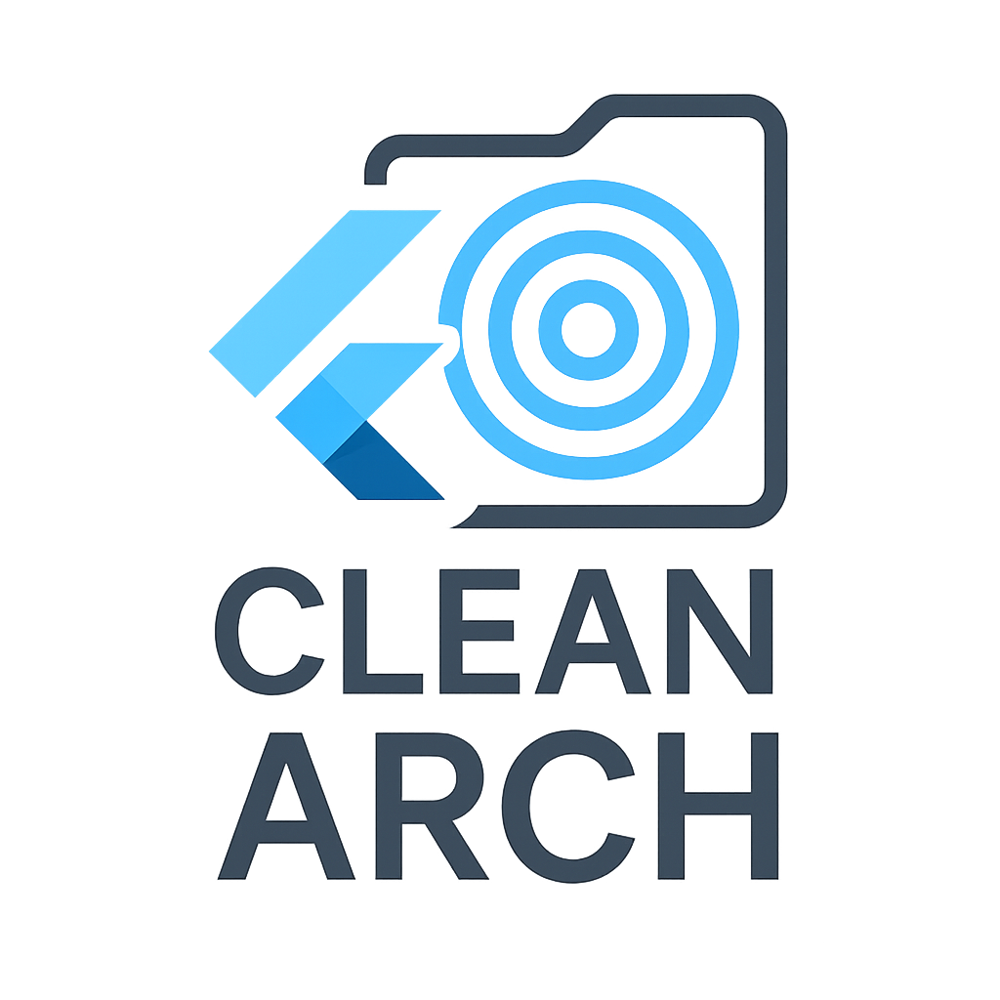

# Flutter Clean Architecture Helper



### A VS Code extension to streamline creating feature folders and use cases in Flutter projects using Clean Architecture.

---

## Features

This extension provides the following functionalities:

1. **Create Feature Folders**: Automatically generates the folder structure for a new feature following Clean Architecture principles.
    - After entering the feature name, you'll be asked whether to include **Injectable annotations** (`@LazySingleton`) in the generated files (since version 1.5.0).
2. **Create Use Case**: Quickly create a use case within an existing feature.

---

## Commands

The following commands are available in the Command Palette (`Ctrl+Shift+P` or `Cmd+Shift+P` on macOS) under the `Arch` category:

### 1. Create Feature Folders

**Command:** `Create Feature Folders`

- **Description**: Generates the Clean Architecture folder structure for a new feature in your project.
- **Usage**:
  1. Open the Command Palette and run the `Create Feature Folders` command.
  2. Enter a feature name (e.g., `auth`, `home`).
  3. Choose whether you want **Injectable annotations** added (available from version 1.5.0).
  4. The following folder structure will be generated:
    ```
    lib/
      features/
        feature_name/
          domain/
            entities/
            repo/          // or repository/ based on folder setup
            usecases/
          data/
            datasources/
              remote/
            models/
            repo/
          presentation/
            blocs/
            pages/
            widgets/
    ```

### 2. Create Use Case

**Command:** `Create Use Case`

- **Description**: Adds a use case class to a specified feature’s `domain/usecases` folder.
- **Usage**:
  1. Open the Command Palette and run the `Create Use Case` command.
  2. Enter the feature name (must already exist).
  3. Enter the use case name (e.g., `FetchUserData`), and a file with the following template will be created:
    ```dart
    import 'package:dartz/dartz.dart';
    import 'package:injectable/injectable.dart';

    @lazySingleton
    class FetchUserDataUseCase {
      final Repo _repo;

      FetchUserDataUseCase(this._repo);

      Future<Either<Failure, Entity>> call() async =>
          await _repo.doSomething();
    }
    ```

---

## Installation

1. Go to the [Visual Studio Code Marketplace](https://marketplace.visualstudio.com/) and search for **Flutter Clean Architecture Helper**.
2. Install the extension.
3. Open a Flutter project to start using the commands.

---

## Requirements

- Visual Studio Code version 1.60.0 or higher
- TypeScript and Node.js for local development and compilation (for contributors)

---

## Release Notes

### Version 1.5.0
- **New:** Prompt to choose whether to include **Injectable annotations** (`@LazySingleton`) in generated files.

### Version 1.4.0
- Added icon for Marketplace display.

### Version 1.1.0
- **New Command:** `Create Use Case`
- Merged `Create Feature Folders` and `Create Use Case` functionalities into a single extension for streamlined workflow.

### Version 1.0.0
- Initial release with `Create Feature Folders` command.

---

## Contributing

Feel free to open issues or submit pull requests to improve the extension.

---

## Support

For any issues or feature requests, please open an issue on the [GitHub repository](https://github.com/MHDN55/Flutter-clean-arch-feature).

---

Happy coding with Clean Architecture in Flutter! 🚀
